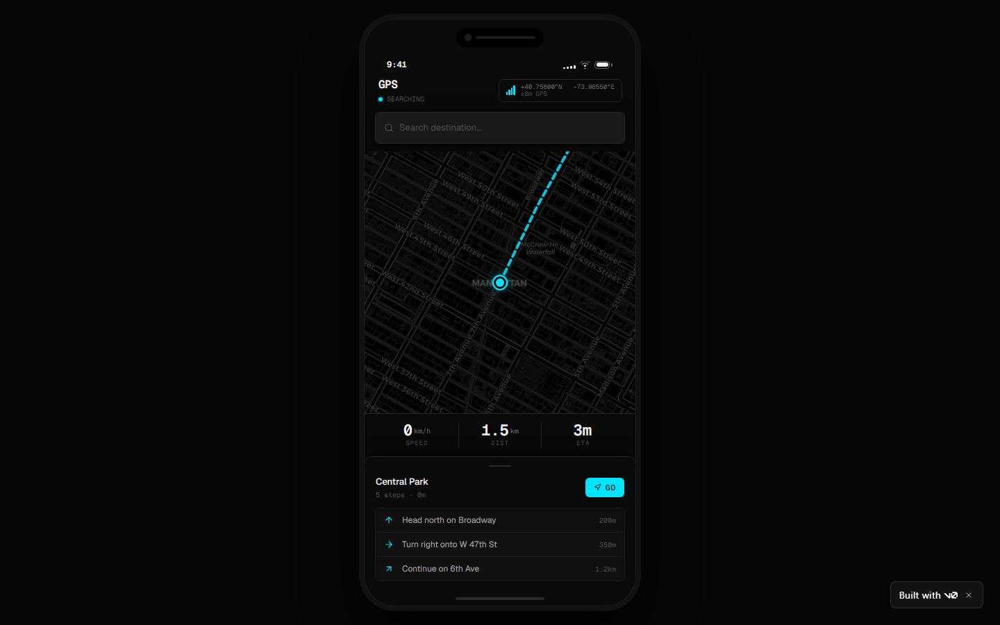
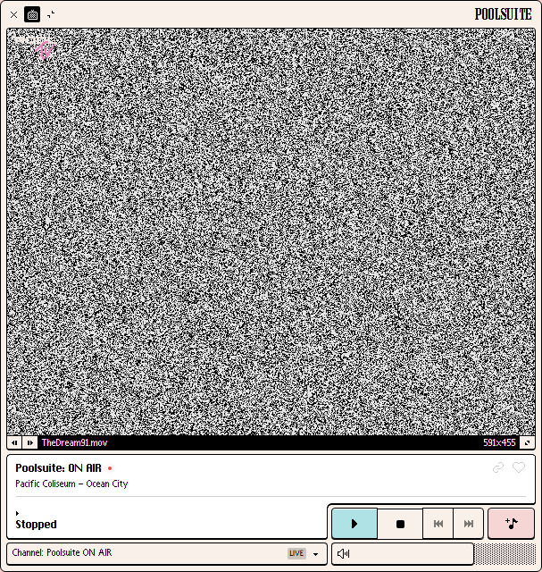
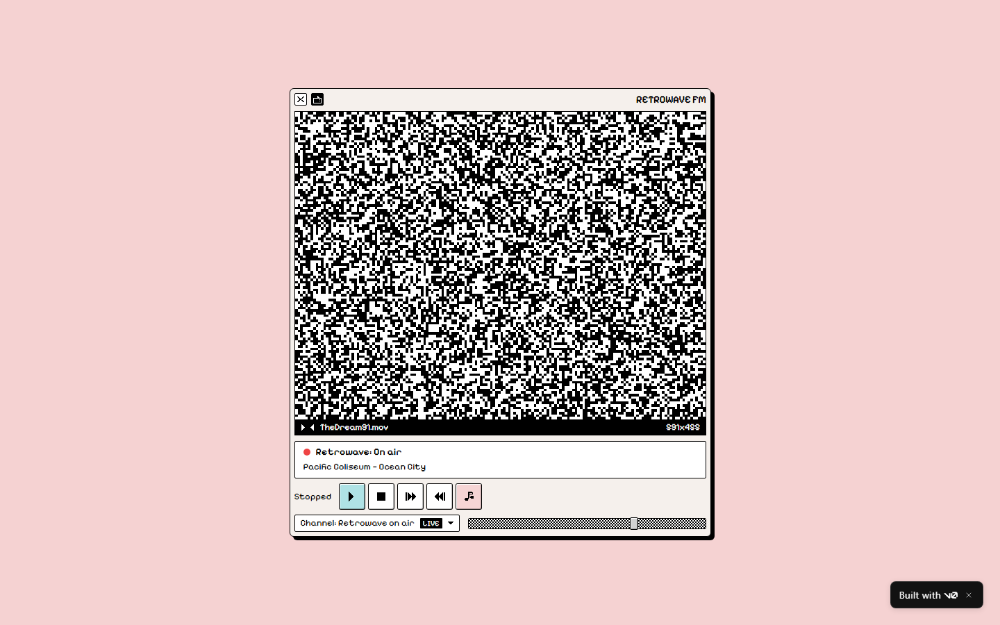
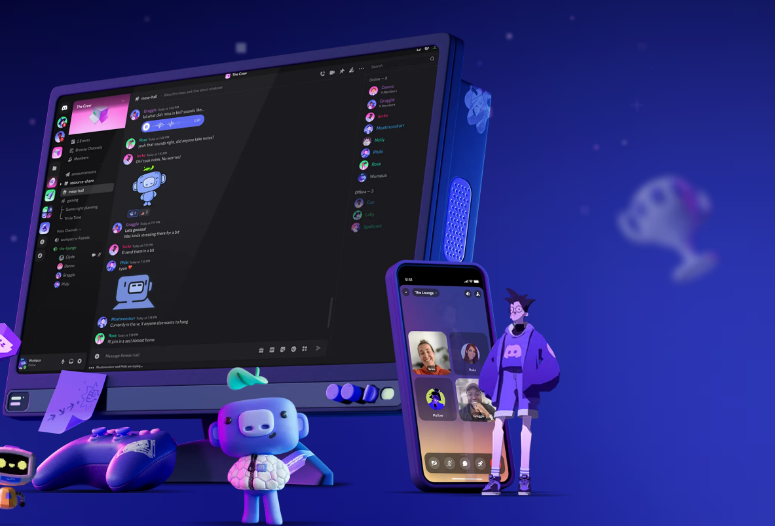
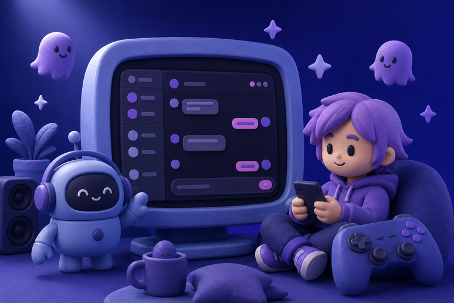
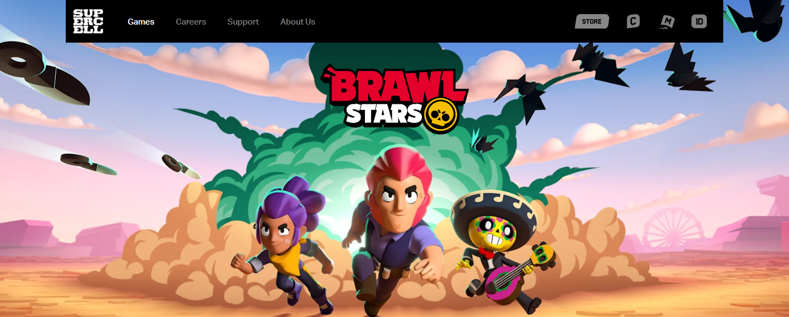
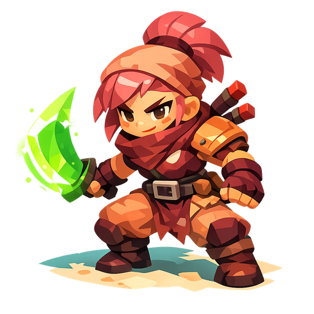

<div align="center">

# anydesign

### Point it at anything visual. Get a design system back.

A Claude skill that turns **images, websites, and Figma files** into structured,
machine-readable design specs — and copies **single elements** (navbars to 3D art)
as rebuild prompts any AI can execute.

[](https://opensource.org/licenses/MIT)
[](./CHANGELOG.md)
[](https://docs.claude.com/en/docs/agents-and-tools/agent-skills/overview)
[](https://www.designtokens.org/)
[](https://github.com/uxKero/anydesign/stargazers)

**[Install](#-install)** · **[See it work](#-see-it-work)** · **[Element mode](#-element-mode--copy-just-that)** · **[CLI scripts](#-standalone-cli-scripts)** · **[Examples](./examples)**

</div>

---

## 🧠 What it does

**`anydesign` runs in Claude — its output is universal.** Plain Markdown + W3C DTCG
JSON that v0, Lovable, Cursor, Bolt, Claude Code, or a human designer can consume.
No lock-in. It's not a description generator — it's a **design diagnostics** tool:
every inference carries a confidence marker (✅ ⚠️ ❓), every color is a real hex,
and inventing tokens is treated as worse than saying "not enough info".

Two modes, picked automatically from what you ask:

| You say | Mode | You get |
|---|---|---|
| *"Extract the design system from this site"* | **Full analysis** | `design.md` (7-section spec) + `design-tokens.json` (DTCG) + optional WCAG report |
| *"Copy this navbar"* / *"Recreate this 3D graphic"* | **Element mode** | A focused `element.md`: code spec + rebuild prompt, or a **token-grounded image prompt** |

---

## 🎬 See it work

Every image below is a real, reproducible run — sources and commands live in
[`examples/`](./examples).

### Act 1 — A full design system becomes a running app

The skill analyzed [vercel.com](https://vercel.com) (808 CSS custom properties
extracted, nothing invented), produced a `design.md`, and v0 built this from it:

[](https://v0-anydesignexample.vercel.app/)

<div align="center"><sup>Live at <a href="https://v0-anydesignexample.vercel.app/">v0-anydesignexample.vercel.app</a> · full run in <a href="./examples/vercel-landing"><code>examples/vercel-landing/</code></a></sup></div>

### Act 2 — One element, rebuilt

Element mode pointed at the retro Mac OS player of
[poolsuite.net](https://poolsuite.net): DOM-precise capture, pixel-sampled palette,
the verbatim bevel-shadow system — and a rebuild prompt that v0 turned into a
working app.

| Captured element | Rebuilt by v0 from the `element.md` |
|---|---|
|  |  |

<div align="center"><sup>Live at <a href="https://retro-radio-player-zz.vercel.app/">retro-radio-player-zz.vercel.app</a> · run details in <a href="./examples/poolsuite-player-element"><code>examples/poolsuite-player-element/</code></a></sup></div>

### Act 3 — Art becomes a prompt that holds

When the element is *art*, you get a generative image prompt **grounded in the
extracted palette** — hex by hex. Discord's 3D hero scene, regenerated on the
first pass: indigo world locked, every accent on its exact extracted hex, original
characters (no brand mascots — there's an IP guardrail).

| Captured element | Generated from the token-grounded prompt |
|---|---|
|  |  |

And the same extraction as an **isolated, web-ready cutout** — single subject,
real alpha, no scenery. Drop it straight into your site:

<p align="center">
  
</p>

<div align="center"><sup>Both prompts + alpha verification in <a href="./examples/discord-hero-asset"><code>examples/discord-hero-asset/</code></a></sup></div>

### Act 4 — Game asset packs that stay consistent

The #1 pain of AI game art is consistency between assets. Element mode extracts a
game's art direction **once** — palette, lighting recipe, color-allocation rules —
and emits a prompt pack where every asset shares that base. One key art in, a
coherent sprite set out:

| Captured key art | Original character generated from the pack |
|---|---|
|  | <p align="center"></p> |

<div align="center"><sup>Prompt pack (character + pickup + prop) in <a href="./examples/game-asset-pack"><code>examples/game-asset-pack/</code></a> · original subjects only, per the IP guardrail</sup></div>

---

## 🚀 Install

```bash
git clone https://github.com/uxKero/anydesign.git

# Personal skills (all projects)
cp -r anydesign ~/.claude/skills/

# OR for a single project
cp -r anydesign /path/to/project/.claude/skills/
```

Optional extras:

```bash
# Python deps for the companion scripts
pip install -r requirements.txt
playwright install chromium   # only for capture_site.py (~300MB first time)
```

To analyze **Figma files**, connect the Figma MCP in the Claude app
(`Settings → Connectors`).

That's it — the skill activates automatically when Claude detects design-analysis
intent ("extract the design system from X", "copy this navbar", "what palette does
this site use"). No command to remember.

---

## 📦 What you get

| File | What it is |
|---|---|
| **`design.md`** | 7-section spec: TL;DR → visual identity (incl. brand voice + the "ONE brand thing") → tokens → components → layout → reconstruction notes → Do's/Don'ts → open questions. YAML frontmatter + `{token.refs}` make it machine-parseable and refactor-safe. |
| **`design-tokens.json`** | [W3C DTCG](https://www.designtokens.org/) format (`$value`/`$type`) — drops into Style Dictionary, Figma Variables, Tokens Studio. |
| **`design-a11y.md`** *(optional)* | WCAG 2.1 contrast report with AA/AAA pass-fail. |
| **`element.md`** *(element mode)* | Scoped spec + rebuild prompt (`code`), token-grounded image prompt (`asset`), or both (`hybrid`). |

---

## 🪄 Element mode — "copy just that"

Sometimes you don't want the whole system — you want *that* navbar, *that* pricing
card, *that* 3D illustration. Say so and the skill captures just the element
(`capture_site.py --selector` grabs its exact bounding box + `outerHTML` on URLs)
and classifies it:

| Kind | Example | Output |
|---|---|---|
| `code` | Navbar, card, button, hero | Scoped token spec + paste-ready rebuild prompt (v0 / Claude Code / Lovable) |
| `asset` | 3D illustration, mascot, photo art | **Token-grounded prompt for image models** (gpt-image, Midjourney, SD/Flux) |
| `hybrid` | A card containing an illustration | Code spec + nested asset prompt |

The image prompts are the differentiator: instead of an impressionistic description,
the prompt embeds the **exact extracted palette**, observed lighting, and the parent
brand's mood — so the regenerated asset *belongs* to the source design. Two delivery
formats: `scene` (composition with background) or `isolated` (single subject,
transparent PNG with alpha, ready for the web).

---

## 🔌 Works with any AI builder

The deliverable is plain text. Anything that reads Markdown can use it.

| Tool | How |
|---|---|
| **[v0](https://v0.dev)** / **[Bolt](https://bolt.new)** / **[Lovable](https://lovable.dev)** | Paste `design.md` as the brief — see both [live](https://v0-anydesignexample.vercel.app/) [demos](https://retro-radio-player-zz.vercel.app/) |
| **[Claude Code](https://claude.com/claude-code)** / **[Cursor](https://cursor.sh)** / **[Windsurf](https://codeium.com/windsurf)** | Drop `design.md` + `design-tokens.json` into context, ask for the build |
| **Style Dictionary / Tokens Studio / Figma Variables** | Import `design-tokens.json` directly (DTCG) |
| **gpt-image / Midjourney / SD** | Paste the `element.md` image prompt |
| **Notion / Linear / a human** | `design.md` reads as a designer brief |

---

## 🧰 Standalone CLI scripts

Seven pure-Python tools in [`scripts/`](./scripts) that **work without Claude**:

| Script | What it does | Deps |
|---|---|---|
| `extract_css_vars.py` | Pull every `--*` custom property from a URL's stylesheets, grouped by category | stdlib |
| `capture_site.py` | Playwright captures: multi-viewport, cookie-banner dismiss, scroll-capture, single-element (`--selector`) | `playwright` |
| `extract_colors.py` | Dominant colors from an image, with area % | `Pillow` |
| `check_contrast.py` | WCAG 2.1 contrast table for color pairs | stdlib |
| `lint_design_md.py` | Validate a `design.md` against the spec | stdlib |
| `verify_design.py` | **Drift audit**: compare a `design-tokens.json` against the live URL — is your spec still true? | stdlib |
| `export_for_claude_design.py` | Bundle tokens into PPTX/DOCX/CSS/Tailwind for [claude.ai/design](https://claude.ai/design) | `pyyaml`, `python-pptx`, `python-docx` |

<details>
<summary><b>Command examples</b></summary>

```bash
# Pull design tokens from any URL — no Claude needed
python scripts/extract_css_vars.py https://vercel.com/ --pretty

# Multi-viewport responsive captures
python scripts/capture_site.py https://your-site.com --viewports desktop,tablet,mobile

# Capture a single element (screenshot + outerHTML)
python scripts/capture_site.py https://your-site.com --selector "header.navbar" -o element.png

# WCAG contrast check
python scripts/check_contrast.py --pair "#111,#FFF" --pair "#3B82F6,#FFF"

# Validate a generated design.md
python scripts/lint_design_md.py path/to/design.md

# Audit declared tokens vs live site (the drift tool)
python scripts/verify_design.py path/to/design-tokens.json https://vercel.com/

# Bundle a design.md + tokens for upload to claude.ai/design
python scripts/export_for_claude_design.py path/to/design.md --out my-brand-bundle/
```

Each script has `--help`.

</details>

---

## 💡 More you can do with it

<details>
<summary><b>Use with Claude Design</b> — get your captured brand into claude.ai/design persistently</summary>

<br>

[**Claude Design**](https://claude.ai/design) (Anthropic Labs) builds a persistent
design system from brand assets you upload — PPTX decks, DOCX briefs, code repos.
It doesn't ingest DTCG JSON or markdown directly, so the
`export_for_claude_design.py` script bridges the gap:

```bash
python scripts/export_for_claude_design.py path/to/design.md --out my-brand/
```

| File | What Claude Design does with it |
|---|---|
| `brand-kit.pptx` | Primary asset — cover, atmosphere, swatches, typography, components, Do's/Don'ts |
| `brand-overview.docx` | The full `design.md` as Word — use as the brand brief |
| `tokens.css` | `:root { --... }` from your DTCG tokens — link via "Code repository" |
| `tailwind.config.ts` | Same path, Tailwind v3 form — either works |
| `README-claude-design.md` | Upload instructions |

Workflow: run anydesign → export the bundle → upload it in Claude Design's
design-system setup → every future project in your org defaults to that brand.
Real bundle from the Vercel run:
[`examples/vercel-landing/claude-design-bundle/`](./examples/vercel-landing/claude-design-bundle).

</details>

<details>
<summary><b>Use cases</b> — eight real scenarios</summary>

<br>

- **🎨 Replicate a reference** — *"I love how Linear's landing feels — analyze it so I can brief my team."* HTML + CSS vars extracted as explicit tokens, `design.md` ready for a Notion brief.
- **🧩 Tokens from a screenshot** — *"Pull the palette and typography from this Dribbble shot."* Direct vision + `extract_colors.py` for pixel-precise hexes, confidence-marked.
- **🪄 Copy one element — including art** — *"Give me a prompt to generate this 3D blob for my own palette."* Element mode: token-grounded image prompt + consistency notes telling you which hex to swap for *your* brand.
- **🛠️ Brief an AI builder** — *"A portfolio like vercel.com but simpler — give me something I can hand to v0."* Reconstruction-emphasis `design.md`, paste and go.
- **🎯 Audit a Figma handoff** — declared variables (`get_variable_defs`) cross-referenced against actual usage; inconsistencies land in Open Questions.
- **🔍 Design vs production** — pass the Figma file *and* the live site; get a discrepancies section: diverged tokens, off-spec components, missing states.
- **📚 Document a legacy product** — extract the implicit system your team built without naming it; start from a baseline instead of zero.
- **♿ WCAG quick-check** — `design-a11y.md` with AA/AAA ratios for every captured text/surface pair.

</details>

<details>
<summary><b>How the skill thinks</b> — workflow + project structure</summary>

<br>

A strict 5-step workflow (full detail in [SKILL.md](./SKILL.md)):

```
Step 1 — Identify source, mode (full vs element), and emphasis
   ↓
Step 2 — Capture material
         (vision / HTML + CSS vars / Playwright / Figma MCP)
   ↓
Step 3 — Layered analysis (Identity → System → Components → Layout
         → Reconstruction → Brand rules) + Art Direction QA pass
   ↓
Step 4 — Generate design.md + design-tokens.json   (or element.md)
   ↓
Step 5 — Deliver + suggest next step
```

The layered analysis goes general → specific, never jumping from "mood" to "tokens"
without passing through "system" — that's what makes the output coherent.

```
anydesign/
├── SKILL.md                       Main instructions (the "brain")
├── references/                    Loaded on-demand (progressive disclosure)
│   ├── capture-flows.md           How to capture each source type
│   ├── analysis-framework.md      The analysis layers in detail
│   ├── token-extraction.md        Token inference rigor + DTCG
│   ├── output-template.md         design.md template
│   └── element-copy.md            Element mode: element.md + image prompts
├── scripts/                       7 standalone CLI tools
└── examples/                      Real, reproducible runs
    ├── vercel-landing/            Full analysis of vercel.com (+ Claude Design bundle)
    ├── landing-example/           Synthetic minimal example
    ├── poolsuite-player-element/  Element mode, code path (+ v0 rebuild)
    ├── discord-hero-asset/        Element mode, asset path (+ generated images)
    └── v0-downstream-demo/        The original downstream proof
```

</details>

---

<div align="center">

**MIT** · See [LICENSE](./LICENSE) · Changelog in [CHANGELOG.md](./CHANGELOG.md)

Made something with anydesign? **[Open an issue and show it](https://github.com/uxKero/anydesign/issues)** ✨

</div>
